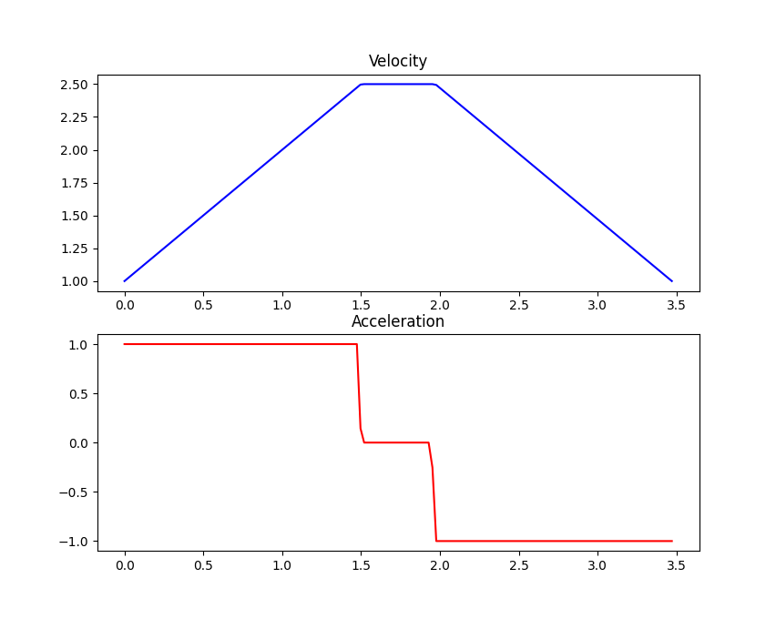

Constraints
===========

The robot's :doc:`Constraints <api/structsquiggles_1_1_constraints>` provide the 
maximum allowable dynamics for the generated paths. Careful measurement and 
configuration of these parameters ensures that the path will not expect the 
robot to move more quickly than it actually can. Resolving such discrepancies in
the generated path and reality is an important first step in ensuring that the 
robot performs reliably.

Maximum Velocity
----------------

The simplest constraint for the robot's motion is its **Maximum Velocity**. This
value can be found by one of two methods: calculation and measurement. There are
a lot of options for measuring the maximum velocity; we'll focus on the calculation
option here.

Calculating the theoretical maximum velocity can be done easily without using
the actual robot. So long as you know the **wheel diameter** and **motor velocity**
for the drivetrain you can calculate the robot's maximum velocity.

Let's say we have 4 inch wheels and 200rpm motors on the robot's drive. We'll
first convert these values into the right units:

.. code::

  4 inches * 0.0254 inches/meter = 0.1016 meters

.. code::

  200 rpm / 60 seconds/minute = 3.333 revolutions per second

We then find the *circumference* of the wheels and multiply by the rate of 
rotation of the motor to get the velocity.

.. code::

  Circumference = PI * Diameter = 3.14 * 0.1016 = 0.319 meters
  Velocity = Circumference * Rotation Rate = 0.319 * 3.333 = 1.063 meters per second

Maximum Acceleration
--------------------

Let's assume that we're using the same robot as above with the 4 inch wheels and
200 rpm motors. If we're using the 
`VEX V5 Smart Motors <https://www.vexrobotics.com/276-4840.html#additional>`
on the drive then our 200 rpm motors will have a stall torque of 1.05 Nm. We 
won't be able to hit that value while keeping the robot moving and we don't want
to push the motors *that* hard all the time. Let's set our maximum torque at 0.5
Nm for the robot's movements to keep the current down and the motors happy.

We can use the physics equations for torque and force to find the maximum acceleration 
for our robot. First, let's find the maximum force that the robot can deliver.

.. code::

  Torque = wheel radius * force 
  0.5 Nm = (0.1016 meters / 2) * force 
  Force = 9.843 N

We can then use Newton's second law and the mass of our fictional robot to find 
the maximum acceleration. It is important to remember that we are looking for 
the *sum* of the forces so we will account for each motor on the drive. Let's 
give our fictional robot 4 drive motors for a total of :code:`9.843 * 4 = 39.372`
Newtons.

.. code::

  Sum of Force = mass * acceleration
  39.372 = 10 Kg * acceleration 
  acceleration = 3.937 meters per second per second

Maximum Jerk
------------

The calculations for maximum jerk are not nearly as convenient as the above
calculations for velocity and acceleration. The easiest option for this parameter 
is to set it to an arbitrary value that's a bit larger than your acceleration,
like twice as large. This can be a good fiddle-factor to get the robot's movement 
to be smoother or more aggressive than default.

Resources
---------

- :doc:`Class Reference <api/structsquiggles_1_1_constraints>`