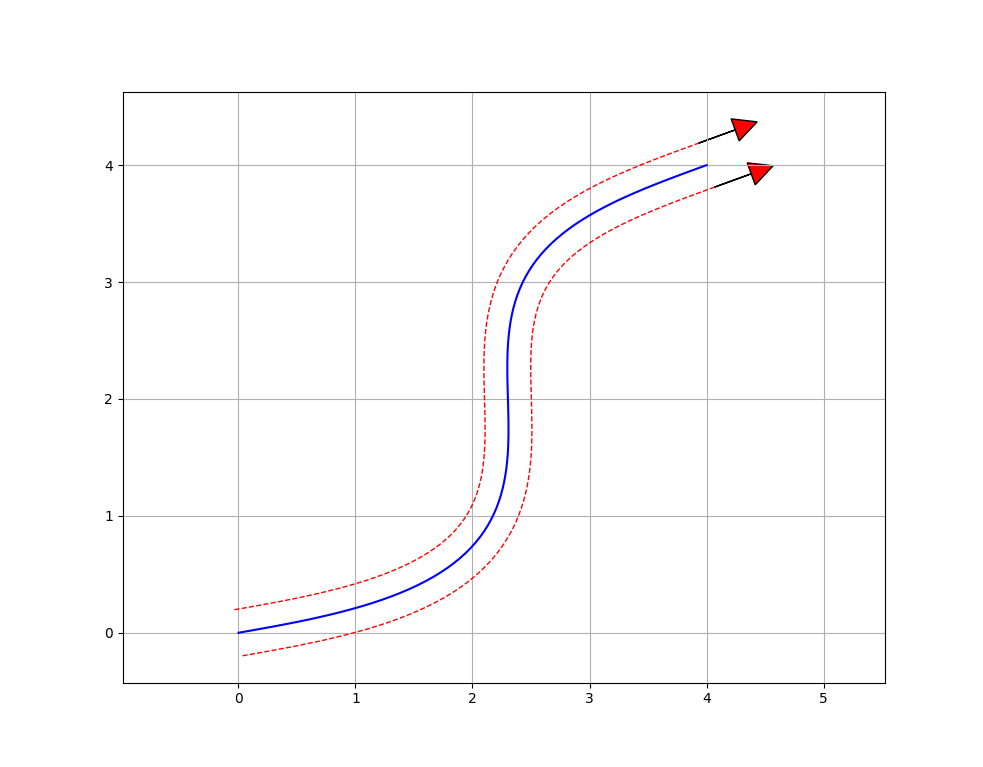

Example Paths
=============

Basic Path
----------

The above path can be created in three simple steps. First, define the
:doc:`Constraints <api/structsquiggles_1_1Constraints>` with the robot's 
maximum velocity, acceleration, and jerk when driving:

.. code-block:: cpp

  #include "squiggles.hpp"

  const double MAX_VEL   = 2.0; // in meters per second
  const double MAX_ACCEL = 3.0; // in meters per second per second
  const double MAX_JERK  = 6.0; // in meters per second per second per second

  squiggles::Constraints constraints = squiggles::Constraints(MAX_VEL, MAX_ACCEL, MAX_JERK);

Then measure the width between the robot's wheels and create a 
:doc:`SplineGenerator <api/classsquiggles_1_1_spline_generator>`
with the constraints and the width measurement:

.. code-block:: cpp

  #include "squiggles.hpp"

  const double MAX_VEL     = 2.0; // in meters per second
  const double MAX_ACCEL   = 3.0; // in meters per second per second
  const double MAX_JERK    = 6.0; // in meters per second per second per second
  const double ROBOT_WIDTH = 0.4; // in meters

  squiggles::Constraints constraints = squiggles::Constraints(MAX_VEL, MAX_ACCEL, MAX_JERK);
  squiggles::SplineGenerator generator = squiggles::SplineGenerator(
    constraints,
    std::make_shared<squiggles::TankModel>(ROBOT_WIDTH, constraints));

And finally let's set the starting and ending poses as shown in the image above:

.. code-block:: cpp

  #include "squiggles.hpp"

  const double MAX_VEL     = 2.0; // in meters per second
  const double MAX_ACCEL   = 3.0; // in meters per second per second
  const double MAX_JERK    = 6.0; // in meters per second per second per second
  const double ROBOT_WIDTH = 0.4; // in meters

  squiggles::Constraints constraints = squiggles::Constraints(MAX_VEL, MAX_ACCEL, MAX_JERK);
  squiggles::SplineGenerator generator = squiggles::SplineGenerator(
    constraints,
    std::make_shared<squiggles::TankModel>(ROBOT_WIDTH, constraints));

  std::vector<squiggles::ProfilePoint> path = generator.generate({
    squiggles::Pose(0.0, 0.0, 1.0), 
    squiggles::Pose(4.0, 4.0, 1.0)});

Tight Path
----------

.. image:: img/neg_wheel_vel.png
    :alt: Tight Path
    :align: center

The generated paths can get a bit more interesting when trying to make tight
turns. The path shown above sends negative velocities to the inner wheel during
the turns in order to make turns in a small space.

We can reuse the :code:`SplineGenerator` from the previous section for this 
second path. It is often easiest, though not required, to create the 
:code:`SplineGenerator` once and call its :code:`generate()` method as many 
times as needed.

.. code-block:: cpp

  std::vector<squiggles::ProfilePoint> path = generator.generate({
    squiggles::Pose(0.0, 0.0, 1.0), 
    squiggles::Pose(0.0, 2.0, 1.0)});