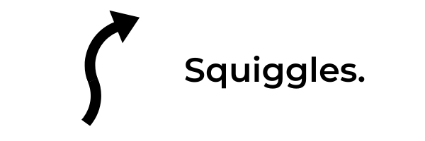

.. squiggles documentation master file, created by
   sphinx-quickstart on Thu Oct 29 19:54:23 2020.
   You can adapt this file completely to your liking, but it should at least
   contain the root `toctree` directive.

Squiggles
=========

A library for generating spline-based paths for robots.

The "squiggles" created by this path generation library allow for smooth, fast
autonomous movements. Robots can follow the generated paths through the use of
the wheel velocities calculated at each point *along with an appropriate feedback
controller*.

Getting Started
---------------

**1. Install the Library**

The list of installation options and their instructions can be found in :doc:`installation`.

**2. Find Your Robot's Constraints**

The guide in :doc:`constraints` should help you identify the size and speed of
your robot.

**3. Generate Some Paths**

You can follow along with the examples in :doc:`example-paths` or jump straight
into the :doc:`api/library_root`.

**4. Add a Closed Loop Controller**

It is possible to directly command the generated wheel velocities to a robot but
any mismatch between your robot measurements and reality will cause your robot
to go off course. Writing a closed-loop path following controller is an exercise
left to the reader but the :doc:`controller-suggestions` document has some tips
to help get you started.

Table of Contents
----------------- 

.. toctree::
   :caption: Basics
   :titlesonly:

   installation
   example-paths
   constraints
   controller-suggestions

.. toctree::
   :caption: Internals
   :titlesonly:

   physical-models
   maths

.. toctree::
   :caption: API Reference
   :maxdepth: 2
   
   api/library_root

.. toctree::
   :caption: Additional Material
   :titlesonly:

   release-notes/index
   resources

